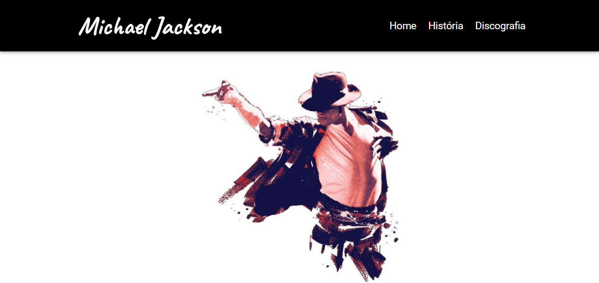

    

# Site sobre Michael Jackson
Este é um site criado em React JS dedicado à vida e à música do lendário artista Michael Jackson.

## Sobre Michael Jackson
Michael Joseph Jackson (29 de agosto de 1958 - 25 de junho de 2009) foi um dos artistas mais influentes da história da música. Conhecido como o Rei do Pop, ele deixou um legado duradouro na indústria musical, combinando habilidades de canto e dança com uma presença carismática no palco.

Este site pretende ser uma homenagem à sua vida, sua música e seu impacto cultural.

## Conteúdo
### História
Explore a fascinante jornada de Michael Jackson, desde sua infância no grupo Jackson 5 até sua carreira solo, seus álbuns icônicos, suas contribuições filantrópicas e seu legado duradouro.

### Discografia
Navegue por uma lista completa dos álbuns de estúdio, álbuns ao vivo e coletâneas lançados por Michael Jackson ao longo de sua carreira lendária.

## 🚀 Tecnologias Utilizadas
Este site foi desenvolvido utilizando as seguintes tecnologias:

- ReactJS: https://react.dev/learn
- React Router Dom: https://reactrouter.com/en/main